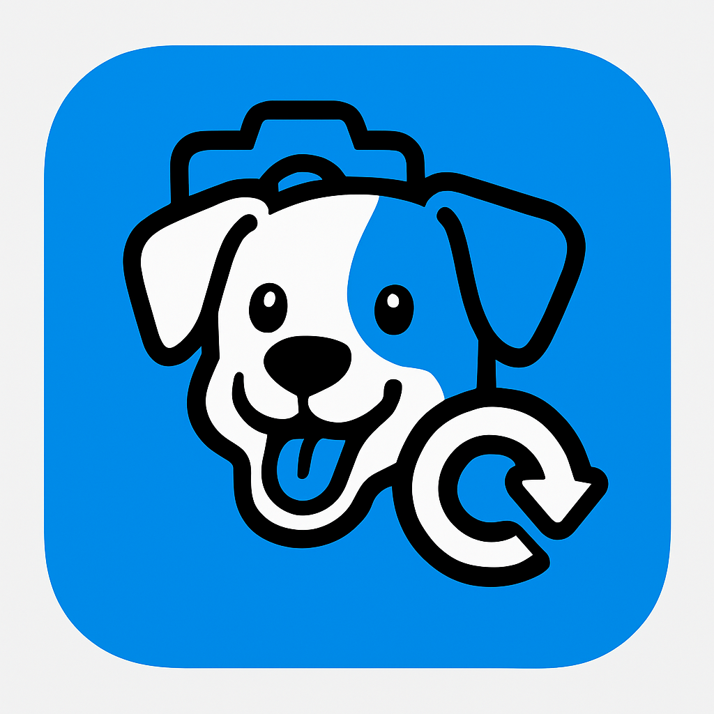
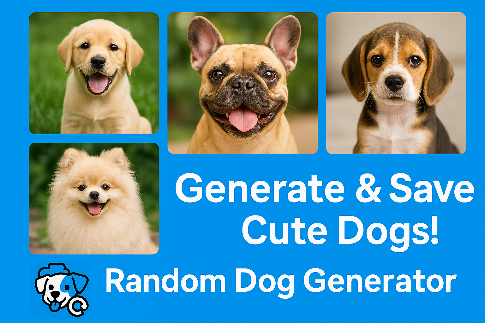
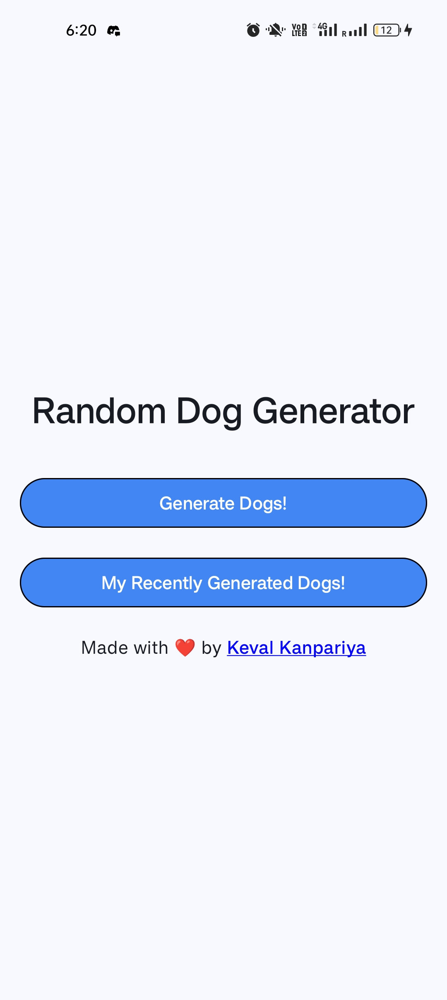
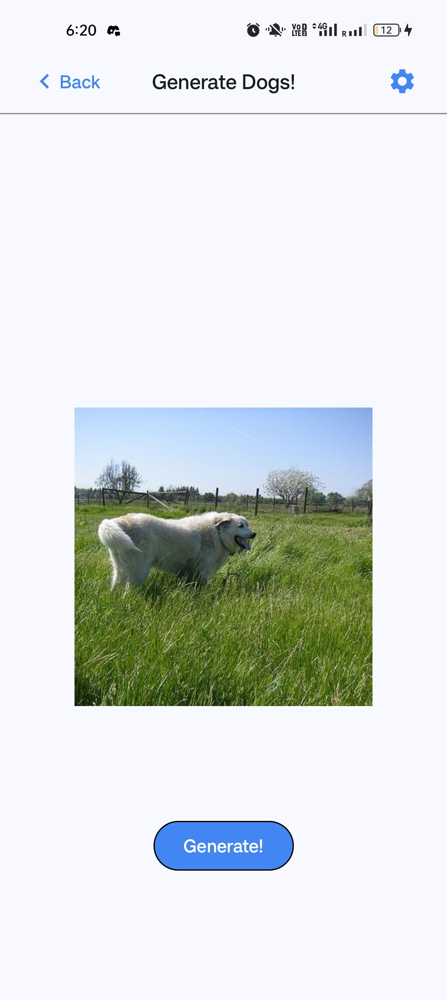
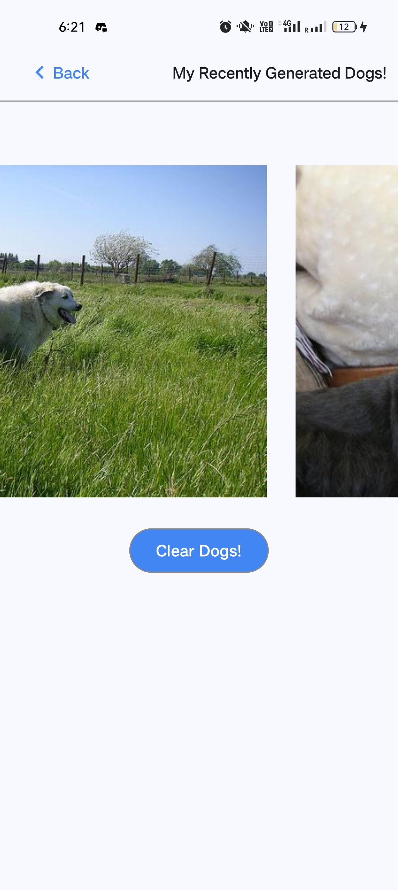
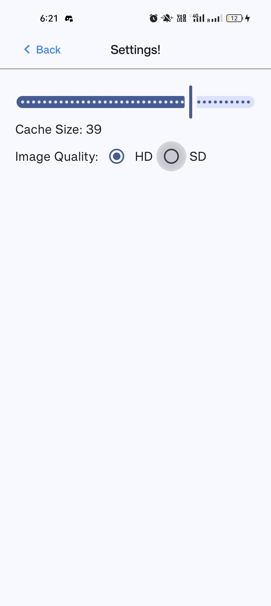

# Random Dog Generator



## 📌 Overview
Random Dog Generator is an Android app built using Jetpack Compose that allows users to generate and save random dog images from an API. Cached images can be viewed later in a gallery.



---

## 📱 Screenshots
| Home Screen | Generate Dogs Screen | My Recently Generated Dogs Screen | Settings Screen |
|------------|--------------------|-----------------|-----------------|
|  |  |  |  |

---

## 🎥 App Demo Video
[Watch the Video on Google Drive](https://drive.google.com/file/d/1a1jxKTDyxHD-ler4qBPBBxtY4KWXY1OB/view)

---

## 🚀 Features
- Fetch random dog images from [Dog CEO API](https://dog.ceo/api/breeds/image/random)
- Cache the last 20 generated images persistently
- View cached images in a scrollable gallery
- Clear all saved images with one button click

---

## 🛠️ Tech Stack
- **Language:** Kotlin
- **UI:** Jetpack Compose
- **Image Loading:** Coil
- **State Management:** ViewModel + StateFlow
- **Architecture:** MVVM

---

## 📖 Build & Run Instructions

### 🔹 Open Project in Android Studio
1. Open **Android Studio**
2. Click on **Open an Existing Project**
3. Select the cloned repository folder
4. Let **Gradle sync** the dependencies

### 🔹 Build & Install APK
#### 1. Using Android Studio
- Click on **Run ▶️** or use `Shift + F10`
- Select a connected device or emulator

#### 2. Using Command Line
```sh
./gradlew assembleDebug
adb install app/build/outputs/apk/debug/app-debug.apk
```

### 🔹 Run the App
- Launch the app from your device’s **app drawer**

---

## 🎨 UI Design Colors
- Primary Button Color: `RGB(66, 134, 244)`
- Background Color: Light Mode Default

---

## 🤝 Contributing
Feel free to fork this repo and submit pull requests!

---

## 📜 License
This project is open-source under the [MIT License](LICENSE).

